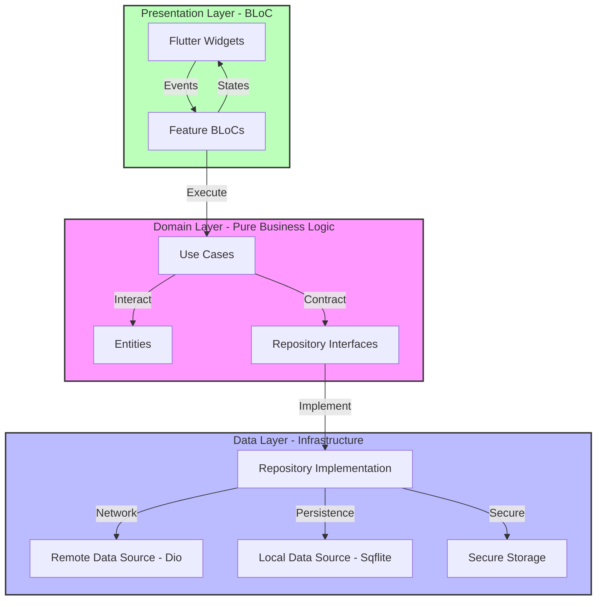
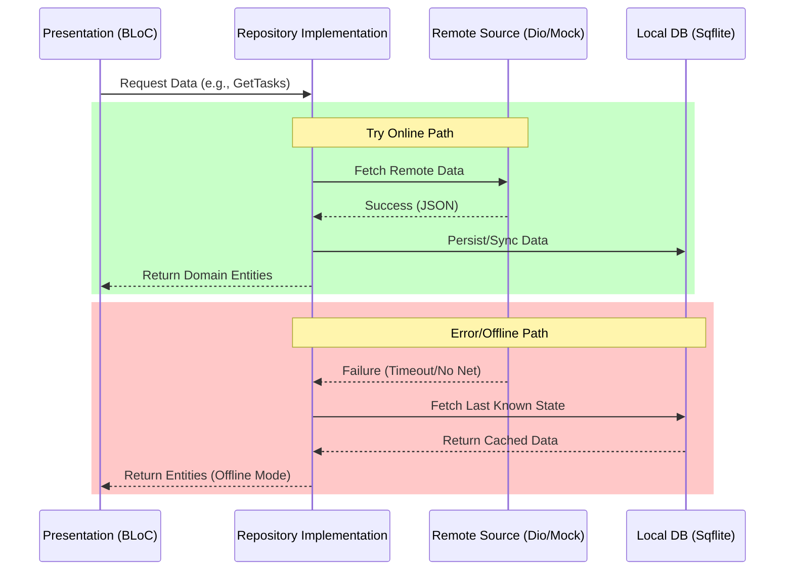

# 🚀 TaskFlow: High-Performance Task Management

**TaskFlow** is a premium, industrial-grade task management solution built with Flutter. It demonstrates a mastery of **Clean Architecture**, **State Management**, and **Offline-First Resilience** within a high-fidelity dark-themed design system.

---

## 🏗️ Architectural Blueprint (Clean Architecture)

TaskFlow is architected with strict layer boundaries to ensure zero leakage of implementation details into the business logic.



### 🎯 Strategic Layer Abstraction
- **Manual Value Equality**: To keep the **Domain Layer** 100% pure, we manually override `operator ==` and `hashCode` for all entities, removing dependencies like `Equatable`.
- **Dependency Inversion**: Use cases depend on abstract repository contracts, allowing the infrastructure (Data Layer) to be swapped without touching business logic.

---

## 💾 The "Ironclad" Offline-First Strategy

TaskFlow ensures productivity remains uninterrupted by implementing a sophisticated synchronization and fallback mechanism.



---

## 🛠️ Advanced Tech Stack & Implementation

| Technology | Implementation Depth |
| :--- | :--- |
| **State Management** | **BLoC (flutter_bloc)**: Reactive event-driven architecture with dedicated states for Loading, Success, and failure-handling with previous state retention. |
| **Dependency Injection** | **GetIt**: Optimized wiring using `LazySingletons` for services and `Factories` for UI-bound logic. |
| **Networking** | **Dio**: High-performance HTTP client with interceptor support and custom error mapping to Domain-level Failures. |
| **Local DB** | **Sqflite**: Relational persistence with indexed columns for performant project/task filtering. |
| **Secure Storage** | **AES Encryption**: Sensitive session tokens stored via `EncryptedSharedPreferences` on Android. |
| **Navigation** | **GoRouter**: Declarative, URL-based routing with deep-link support and Auth-guarded redirects. |

---

## 🧪 Testing & Reliability

TaskFlow is verified by a comprehensive test suite that treats the Domain and Data layers as mission-critical systems.

- **40+ Automated Tests**: Covering full CRUD lifecycle and Auth edge cases.
- **Contract Verification**: Ensuring Repository implementations correctly transform Models to Entities.
- **State Transition Testing**: Using `bloc_test` to verify UI logic under extreme conditions (e.g., refreshing expired sessions).

```bash
# Run the complete test suite
flutter test
```

---

## 🎨 Design System: "Industrial Dark"

The UI is built on a custom design system characterized by:
- **Diagonal "Cut Corner" Borders**: A signature industrial aesthetic applied to cards, buttons, and sheets.
- **High-Contrast Palette**: Utilizing **Lime (#D4FF3D)** for primary actions and **Deep Carbon (#0B0C0E)** for backgrounds.
- **Dynamic Typography**: Leveraging `google_fonts` (Bebas Neue & Inter) for a professional, dashboard-centric feel.

---

## 🔐 Mock Access

| Role | Email | Password |
| :--- | :--- | :--- |
| **Org Admin** | `ava.admin@nimbusdigital.test` | `Password123!` |
| **Member** | `marcus.member@nimbusdigital.test` | `Password123!` |

---
Developed as a showcase of modern Flutter engineering.
