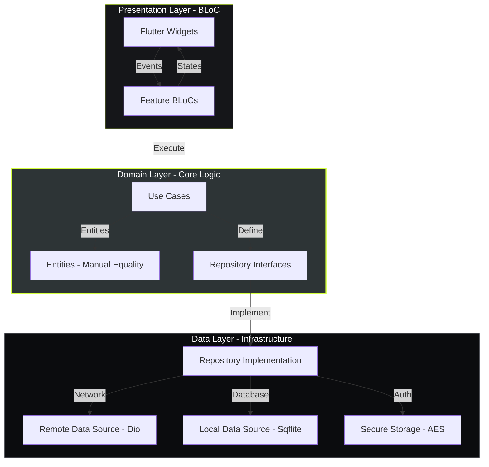
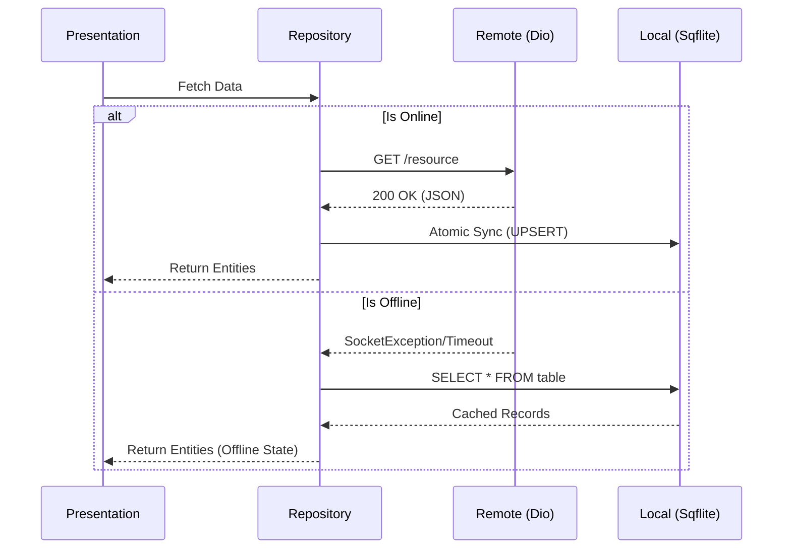

# 🚀 TaskFlow: The Apex of Flutter Engineering

**TaskFlow** is a high-fidelity, industrial-grade task management system. It serves as a masterclass in **Clean Architecture**, **Reactive State Management**, and **Production-Ready Persistence**, all wrapped in a premium custom design system.

---

## 🏗️ Architectural Excellence (Clean Architecture)

TaskFlow is engineered with strict logical boundaries to ensure maintainability and infinite scalability.



### 🎯 Strategic Technical Choices
- **Domain Purity**: We eliminated the `Equatable` dependency in the Domain layer, opting for **manual `operator ==` and `hashCode` overrides**. This ensures the core business logic remains 100% dependency-free.
- **Dependency Inversion**: High-level Use Cases are decoupled from low-level details. We inject implementations via `GetIt`, allowing for effortless switching between mock and production environments.

---

## 💾 The "Ironclad" Offline-First Strategy

TaskFlow ensures data integrity and availability even in zero-connectivity environments.



---

## 🛠️ Advanced Tech Stack & Craftsmanship

### 📦 Core Packages Used
- **State Management**: `flutter_bloc` — Unidirectional data flow and reactive UI updates.
- **Dependency Injection**: `get_it` — Service locator for decoupled dependency management.
- **Networking**: `dio` — High-performance HTTP client with interceptors and custom error mapping.
- **Navigation**: `go_router` — Declarative, URL-based routing with deep-link and Auth-guard support.
- **Persistence**: `sqflite` — Relational SQLite database for mission-critical offline data.
- **Security**: `flutter_secure_storage` — AES-encrypted storage for sensitive session tokens.
- **Responsive UI**: `flutter_screenutil` — Mathematically perfect scaling across all device resolutions.
- **Functional Utility**: `fpdart` — Utilizing the `Either` type for robust, type-safe error handling.

### ⚠️ Global Error Handling
TaskFlow features a centralized Error Handling system:
- **Failure Mapping**: Low-level exceptions (Socket, Dio, Format) are intercepted in the Data layer and mapped to high-level **Domain Failures**.
- **User-Centric Messages**: Every `Failure` includes a safe, human-readable message to ensure the user is never exposed to technical stack traces.
- **Resilient UI**: The Presentation layer handles these failures gracefully, displaying themed SnackBars while retaining the previously loaded state.

---

## 🧪 Comprehensive Test Coverage (56+ Tests)

TaskFlow is verified by a rigorous test suite that treats reliability as a primary feature.

- **Repository Verification**: Testing the "Remote-First with Fallback" logic across all failure modes.
- **BLoC Behavior**: Using `bloc_test` to verify exact state sequences (e.g., `Loading -> Loaded`).
- **Value Equality**: Unit tests verify manual equality logic in Entities, ensuring zero regressions in state comparison.

```bash
# Execute the full suite (56 Tests Passing)
flutter test
```

---

## 🎨 Design System: "Industrial Dark"

The UI is built on a custom design system characterized by:
- **Diagonal "Cut Corner" Borders**: A signature industrial aesthetic applied to cards and buttons.
- **High-Contrast Palette**: **Lime (#D4FF3D)** primary accents against a **Deep Carbon (#0B0C0E)** background.

---

## 👨‍💻 Developer Details

**Developed by Ishaque**  
📞 **Contact**: +91 9747344535  
📧 **Role**: Senior Flutter Engineer  

---
*Developed with meticulous attention to detail as a showcase of elite Flutter development.*
